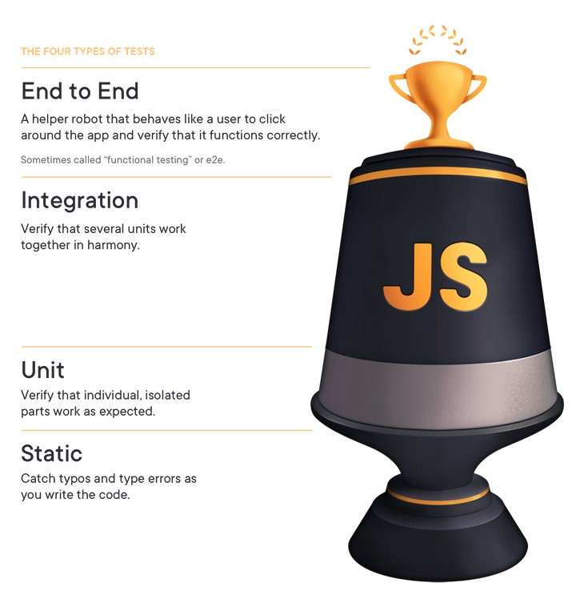
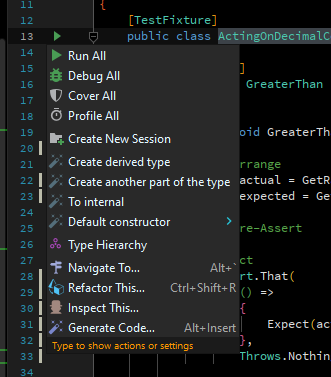
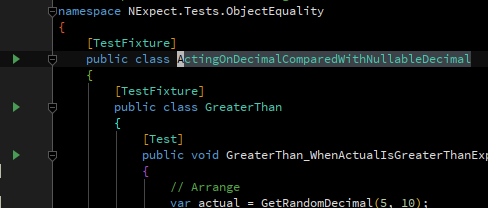

## Introduction

### What is TDD?
Test Driven Development is a programming methodology where tests are written for expected
behavior from production code _before_ writing the production code.

Hence the tests _drive_ the development of the production code

### Why bother doing it?
There are few people who would argue on the benefit of having a good suite of unit tests
against production code, especially if those unit tests can be automatically run and trusted
to provide feedback of the correctness of the code under test.

Ok, so there _are_ a few people who would argue against a good set of automated tests.

On _rare_ occasions, they can have a point. For example, when you're writing proof-of-concept
code, or trying to get out a MVP (minimum viable product) to prove that your idea has merit
so that a client or investor will buy into it.

Whilst this can be a good time to skip the tests, the reality is that few "throw-away solutions"
are actually thrown away. Once you've proven your point, the client will not understand your
desire to start again, when you have something that's "so close to what we need".

Skipping the tests is a choice that can be made, but should not be taken lightly. Skipped
tests form technical debt for any project with an unknown or long-term lifespan.

The debate around TDD mostly stems around the question of _why the tests should be written
first_. It's an easy methodology to argue against -- it seems counter-intuitive, it's
not easy, and, well, there's plenty of "expert programmers" who tell you that they don't do
it and that the whole process is rubbish.

But there are some good reasons:

1. By writing a test first, you are clearly defining the behavior that you'd like the system
    to have. All too often, we want to dive into the code, without first planning out what
    we'd really like to accomplish. I'm not talking about planning every nook and cranny
    of the resultant system -- indeed, I think that doing so is a waste of time and resources,
    as backed up by the number of times I've personally seen a fully-planned project take a
    complete turn away from the final projection in response to customer needs; alternatively,
    I've seen projects that stick to the plan 100% fail at launch because the plan is no
    longer relevant.

    But what we really _do_ want to do, is have a clear idea of _why_ we're about to write
    even one line of code.

    Writing a test not only forces you to think that through -- it also forces you to express
    that in terms that someone else can read, with an artifact that will benefit you later:
2. By writing the test first, we can easily validate when we have written sufficient code
    to meet the requirements we established earlier. And:
3. We now have an artifact which we can run via automation to verify that the code we've written
    conforms to the requirements _at any point in the future_
4. Whilst some up-front design can certainly be beneficial, I've found that designs that _emerge_
    out of TDD practices are often simpler, more robust and more elegant than the initial up-front
    design would have been. In addition, by delaying the intricacies of your design until a later
    stage (Just In Time Design), you'll find that you waste less time on designs which are never
    fully implemented: there's always an edge case that emerges or a requirement that changes. TDD
    works well in a [Lean production environment](https://en.wikipedia.org/wiki/Lean_manufacturing).
    The principles of Lean Manufacturing apply well to modern software development and dovetail
    with Agile methodologies. But all of that is another subject (:

### The TDD Cadence

The term "Cadence" refers to a rhythmic flow of a sequence of sounds or words, but can be
applied to any rhythmic activity. When programming test-first, one enters a cadence:

#### Red
A common misconception about TDD is that we should write _all_ the tests first.

This is a place at which many people, upon trying this approach, declare TDD impractical.

The truth though, is that we should write exactly _one_ test.

In addition, we should _run_ this test, _and it **must** fail_. A purist would state here
that a compilation failure also counts as "Red" -- having a test which describes the required
behavior of the system when the API doesn't exist yet is a good step, and can be used to
drive the design of that API, but honestly, you've only left the Red phase of the TDD cadence
once you've written, compiled and run your single test _and it has failed_.

##### What if the test doesn't fail? Who cares? The production code works then, right?

_NO_

If you wrote a test which immediately went green, you have no proof that the test you wrote
is valid. Here's an example:


```csharp
public class Calculator
{
    public int Add(int a, int b)
    {
        return a + a;
    }

    public int Multiply(int a, int b)
    {
        return a * b;
    }
}

[TestFixture]
public class TestCalculator
{
    [TestFisture]
    public class Add
    {
        [Test]
        public void ShouldAddTwoNumbers()
        {
            // Arrange
            var sut = new Calculator();
            // Act
            var resut = sut.Add(2, 2);
            // Assert
            Expect(result)
                .To.Equal(4);
        }
    }
}

```

The `Calculator` class is clearly buggy. However, the test passes. In addition, the same test
and expected outcome could be applied to the `Multiply` method for a valid, passing test.

The example above should also expose another issue: one test isn't enough. It's quite
possible to have written the test above first, and still have written the buggy code. It
is definitely a mistake, however, to write a test, see it pass immediately, and move on
to the next part of the system. At the very least, your test may not be testing what you
think it is. At the worst, not only is it not testing what you think it is, but what you
think it _should_ be testing is buggy.

If you write the test _after_ the code, and it goes green immediately, you have
no idea if the code is broken or the test is broken. If you've absolutely _had_ to write
the code first (eg if figuring out a library api you're using), you should comment
out the passing code to ensure that your test fails without that code being there.

#### Green
Next comes the fun part! Solving for the test! The idea here is to write the _minimum code
necessary to solve the requirements of the test_.

This _doesn't_ mean you should write the most obscure, shortest code necessary. You still
need to subscribe to good coding standards:
- well-named variables
- clear flow
- one statement per line
- whatever else your team subscribes to

It just means that you should resist the urge to solve the entire requirements of a class
after writing the first test. The reason why should be self-evident: as above, if we solve
everything _now_, before we have a test, then when we write tests and they are immediately
green, they don't verify that we have the correct requirements or the correct response.

#### Refactor
This step is often skipped, not just in TDD cicles, but generally. We are so excited to bang
out the solution and we _know exactly how to get there_! So why wait? Quicker is better, yeah?

Refactoring refers to observing the code in its current state and testing if we could write
it better
- perhaps something could be better-named
- perhaps a block of code could be pulled out into a well-named method
    - a really good indicator of this is if you've added a comment to explain
        what's happening, or, if upon attempting to explain the code to someone else,
        you can point to a few lines of code and explain what's happening there
- perhaps there's even a whole class you can pull out
    - is the class you're working on starting to do a bunch of things? The "S" in SOLID
        refers to "Single Responsibility", basically boiling down to the unix philosophy
        of building small programs which do one thing well and which can talk to each other.
- lastly, perhaps there's a performance optimisation you can make here
    - beware early optimisation
    - code which reads well is worth more than code which runs marginally faster
    - optimisation should be left later in the code-cycle, rather than done earlier as
        prematuve optimisation often leads to having to make sub-optimal code choices later.

The best bit about TDD is that you have so much freedom at this point -- you are free to
explore any refactoring you think might be worthwhile. You can rip out the entire internals
of the production code an literally start again, from scratch. This freedom has been afforded
to you because you have a good suite of automated tests you can run over the production code
to verify if your changes still uphold the requirements.

I've been lucky enough to have the freedom to completely restart a project, more than once,
by simply keeping the test suite and throwing away the code.

### The testing pyramid
Martin Fowler has a [good article about this concept](https://martinfowler.com/articles/practical-test-pyramid.html) which I'm going to try to simplify for this document. I do encourage
you to read the original though, if you have the time.

The _test pyramid_ refers to the classifications and proliferations of tests which make sense
for most development environments. In particular, there are:
- tests which run slowly, but exercise a lot of the system (UI testing, often human-based, often
    manual)
- tests which run with intermediate time and often exercise large portions of the system and how the
    system interacts with other systems (integration testing)
- and tests which run quickly, exercising small portions of the system (unit tests)


An alternative (but really, at a closer look, quite similar) structure is referred to as the
_test trophy_:


Whilst some will argue over the two, they are fundamentally similar in some aspects:
- there are more tests which run quickly than tests which run slowly
- there are tests at different levels, all of which supply value

Part of the anatomy of a good test is how quickly it runs. For some testing scenarios, we don't have
a lot of leeway -- there are simply some tests which will take longer to run. However, if our entire
suite of tests is slow to run, eventually _no-one will run it_.

In addition, smaller, focused tests help to isolate issues when they are introduced:

If we only have e2e tests on an e-commerce site, the closest we can get to diagnosis of a problem
is at which step of the checkout things went awry. When we have unit tests as well, we can often find
the exact issue. And if the issue is new, writing a unit test to replicate the issue assists in
coming up with a durable solution. Future test runs will quickly highlight a regression in this area.

### TDD "gears"

I've heard a few colleagues refer to TDD "gears", meaning that sometimes we TDD at different rates.

I'm not going to try to break that down into a full 5-speed analogy, but I think there is something
here of value: Low Gear vs High Gear

#### Low Gear
When should we "shift down"?
    - when you're new at TDD
    - when the problem space isn't well known

#### High Gear
When should we "shift up"?
    - when you know your way around quite well
    - when the problem space is quite well known

The most common problem, especially amongst those new to TDD, is that of _finding the next test_.
If you reach too far ahead, you're likely to get stuck implementing too much and losing out on
the emergent value of TDD practices. If you're not reaching far enough ahead, you may feel like
you're not accomplishing your task quickly enough and you may end up with some redundant tests.

_When in doubt, rather slow down than speed up_

I'd much rather have a bunch of very closely-related tests than one or two which hardly cover
the production code. The former still gives me the safety net and freedom to refactor (completely
re-implement, if I choose!) and makes it easier for another person to extend the system with
the confidence that they won't break it. The latter often leaves subtle bugs in place which have
to be discovered later, and have a test retro-fitted around before being resolved.

_Quality work **always** trumps quantity of work_

Studies have shown that, of all development time spent on tasks, a far smaller percent is spent on
the initial solution than on debugging and bugfixing it. Rather spend 50% more time going at a steady
TDD pace than 100% more time having to fix the issues you've introduced by rushing.

### Unit testing in .NET with NUnit

#### Running tests

1. From Rider (or using Resharper in Visual Studio)
    ReSharper is a venerable addon by JetBrains for Visual Studio which offers a host
    of useful features including refactoring, static analysis and test running (with coverage
    if so required).
    Rider is an IntelliJ-based IDE for .NET work which communicates to an instance of ReSharper
    running in another process to provide the same functionality as ReSharper in Visual Studio
    without having to run Visual Studio. Apart from being (in my experience) faster and lighter
    to run than Visual Studio, Rider also offers a complete cross-platform product which is
    really great in the age of .NET Core and the upcoming unification of Framework and Core
    into .NET 5

    1. Running from a shortcut
        Both have contextural knowlege of the code at the point where your cursor is. Whilst there
        are different keybinding schemes (and you can customise them too), the most common is the
        "Visual Studio" scheme, which provides the following chorded shortcuts:
        - `Ctrl-U, Ctrl-L`
            - runs all tests in the solution
        - `Ctrl-U, Ctrl-R`
            - run all tests in the current scope
            - since there is contextural knowlege, this means that if your cursor is within a test,
                that test is run. If it is within a test fixture, that entire fixture is run. If it's
                elsewhere, then _absolutely nothing happens_. Well, mostly. There will be a hint in
                the app's status bar that there was no context for your action
        - `Ctrl-U, Ctrl-D`
            - debug all tests in the current scope
            - as above, "the current scope" is determined by your cursor position
    2. Alt-Enter all the things
        - Rider offers `Alt-Enter` contextural assistance throughout your code base. If you
            `Alt-Enter` when your cursor is on the method name of a test, the test will be run.
            Similarly, if you `Alt-Enter` when your cursor is on the name of a test fixture,
            the fixture will be run
            
    3. Margin indicators
        - Rider will figure out where the entry points are for your tests and fixtures and
            will add green "play buttons" (triangles facing right) which you can click to get
            a menu of options, including running the test(s), debugging the test(s) or covering
            the test(s) within that scope
            
    4. The test runner
        - Rider should populate a test runner window with known tests in the project. Discovery
            typically happens after running some tests, but there will also be an "all tests" pane

    Suggestion: commit the shortcut keys to memory. Less time spent reaching for a mouse means
    more time writing code (:
2. From the command-line
    NUnit has a commandline runner which can be downloaded via nuget, allowing a test environment
    to self-bootstrap. If you are consuming any of the projects bootstrapped with `gulp-tasks`, you
    should be able to issue the following command to run all tests in the solution:
    `npm test`
    (you will need to run `npm install` at least once before you can execute tests in this manner)

#### [TestFixture]

The `[TestFixture]` attribute is used to decorate a class containing tests. _Make sure all of your
test fixtures are decorated with this attribute_! Whilst Rider will tolerate tests within a class
not marked as a test fixture, the NUnit commandline runner _will not_. Your tests will be skipped.

#### [Test]
The `[Test]` attribute decorates a test method. This method will be run by the NUnit runner
and the result recorded in whatever output it has been configured to use. Exceptions thrown
within this method will signify failure. Assertions which fail are thrown as exceptions.

#### [TestCase]
This is a "higher gear" attribute -- beware using `[TestCase]` when your cases are not simple! In
particular, if your test has a conditional statement in it, eg:

```csharp
[TestCase("a")]
[TestCase("b")]
public void ShouldDoStuff(string input)
{
    // Arrange
    var sut = Create();
    // Act
    var result = sut.DoStuff(input);
    // Assert
    if (input == "a")
    {
        Expect(result)
            .To.Equal(1);
    }
    else
    {
        Expect(result)
            .To.Equal(2);
    }
}
```

_**Then your test is actually TWO TESTS and should be split out as such**_

#### [TestCaseSource]
Like `[TestCase]`, this provides a mechanism for running multiple scenarios through the same
test logic. Again, beware that this is a "high gear" mechanism which should only be used once
you're very comfortable with TDD and know _for sure_ that it's the _best_ way to get out a bunch
of _meaningful_ tests in optimal time.

`[TestCaseSource]` takes a single string argument, which must be the name of a static method
on the current class, eg:

```csharp
public static IEnumerable<(string input, int expected)> Cases()
{
    yield return ("", 0);
    yield return ("0", 0);
    yield return ("1,2", 3);
}

public void ShouldAdd((string input, int expected) testCase)
{
    // Arrange
    var (input, expected) = testCase;
    var sut = Create();
    // Act
    var result = sut.Add(input);
    // Assert
    Expect(result)
        .To.Equal(expected);
}
```

Notice how the above, whilst testing the functionality of the system-under-test, does little
to describe the requirements for the system. Hence the warning to only use this feature when
it _really_ makes sense.

#### Setup and teardown

`[SetUp]` and `[TearDown]` attributes are applied to methods on a test fixture which
are required to be run before and after a test is run (respectively)

A good example of this is for testing against a database, where we'd like the mutations
from one test _not_ to flow into another. In such a case, under .NET, we could do:

```csharp
[TestFixture]
public class TestDataAccessor
{
    [SetUp]
    public void Setup()
    {
        _scope = TransactionScopes.ReadCommitted();
    }

    [TearDown]
    public void Teardown()
    {
        try
        {
            // simply dispose the scope -- it hasn't been committed
            //  so this rolls back whatever data activity happened
            //  in the tests
            _scope.Dispose()
        }
        catch
        {
            /* ignore - tests should catch errors, not teardown */
        }
    }
}
```

#### [Ignore] vs [Explicit] vs [Category]

Sometimes there's a test you might not want to run on every occasion:

- it's highly dependent on external factors, so it fails frequently
    - beware placing tests in this box though -- rather try to find ways
        to make it more resilient and perhaps to mock out external dependencies
- it's a discovery test
    - unit tests are a great way to discover how an api or system works! Write
        tests, place breakpoints, peer into the belly of the beast. Perhaps
        even write assertions once you're done to illustrate what to expect!
    - however, these tests take time to run and may be against external apis which
        aren't guaranteed to be available, so we'd like to run them _only on specific
        demand_
- it's a big, slow, hairy integration test which illustrates something important but
    which isn't necessary to run as part of regular CI testing

You have three options:

- `[Category("some category")]`
    - groups tests under a category which has to be explicitly requested in a test run
    - by default the nunit runner will only run uncategories, not-ignored, non-explicit
        tests
    - useful when there are integration tests you'd like to run via automation, under
        specific conditions (eg, "these integration tests can only be expected to pass
        between 08h00 and 16h00 when the staging API is available")
- `[Explicit("some reason why")]`
    - useful for tests you'd only like to run by explicitly selecting to run that
        test (eg `Ctrl-U, Ctrl-R` inside the test)
    - this is how I'd usually mark a discovery test: `[Explicit("Discovery: learning about {ABC}"]`
- `[Ignore("some reason why")]`
    - ignored tests are _never_ run. Even if you place your cursor within the test and
        `Ctrl-U, Ctrl-R`, Riders _will not run it_
    - tests should not stay in this state for long
        - if you _really_ have to ignore a test because a release needs to happen and there's
            some ancient test breaking and no-one can tell why, or even what the significance
            of the test is, you may choose to `[Ignore("FIXME")]`
        - if a test remains ignored for a lengthy period of time, one has to ask:
            - does this test provide any useful feedback?
            - should there be a better, replacement test?
            - should this test be fixed?
            - should this test just be deleted (it's being ignored anyway)
    - this should be a temporary, last resort. It's better to mark a test as Explicit because
        at least someone could choose to run (and hopefully fix) the test elsewhere.
