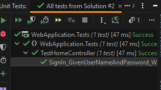
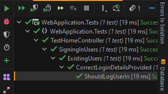
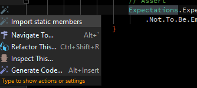

## Diving in

### Anatomy of a “good test”

#### A descriptive name

The name of a test should set the reader up to understand the intent of the test.

There are some popular patterns. The two that stand out are:

##### Given / When / Then

example:

```csharp
[TestFixture]
public class TestHomeController
{
    [Test]
    public void    SignIn_GivenUserNameAndPassword_WhenUserExistsAndPasswordCorrect_ThenShouldSignInUser()
    {
    }
}
```

Anatomy: - Method name - Given (argument provided to the method) - When (conditions under which the method is invoked) - Then (expected result)
Problem: this ends up producing really long method names which may violate coding standards
or at least cause strange wrapping (as above). This is especially noticable when trying to grok
the output of test runs:



##### Describe / Should

example:

```csharp
[TestFixture]
public class TestHomeController
{
    [TestFixture]
    public class SigningInUsers
    {
        [TestFixture]
        public class ExistingUsers
        {
            [TestFixture]
            public class CorrectLoginDetailsProvided
            {
                [Test]
                public void ShouldLogUserIn()
                {
                }
            }

        }
    }
}
```

This structure is inspired by Javascript testing with frameworks like Mocha and Jasmine. It
focuses around grouping tests by functionality and provides for a much easier-to-read
output in test runners:



#### Good tests tell you exactly what broke when they fail

#### Arrange, Act, Assert

- Arrange
  - set up everything required to have your test run
- Validate (optional)
  - perform any initial validations that check that the test environment is
    correctly set up
- Act
  - perform the action to be tested
  - ideally only one line
- Assert
  - assert that the correct result was received / behavior was enacted
  - ideally few asserts for a focused test
  - if you find you're doing lots of asserts, rather copy/paste the
    test and split the asserts up. Rename each variant with what is
    _actually_ being tested

#### Assertions

Assertions should be as specific and informative as possible. Try to avoid assertions
which simply assert that some condition is true or false, if there's a more expressive /
informative way you could perform the assertion.

example:

```csharp
[Test]
public void ShouldReturnAnimals()
{
    // Arrange
    var sut = Create();
    // Act
    var result = sut.FindAllAnimals();
    // Assert
    // bad assertion: when it fails, you get a message like
    //  "expected true, but got false", which tells you
    //  _nothing_ about what actually happened
    Expect(result.Any())
        .To.Be.True();
    // better, but still obscure: you get a message like
    //  "expected 7 but got 0"
    Expect(result.Count())
        .To.Equal(7);
    // best, depending on the knowledge of the system:
    // note how we get as specific as possible
    Expect(result)
        .Not.To.Be.Empty();
    Expect(result)
        .To.Contain.Only(7).Items();
    Expect(result)
        .To.Contain.Only(7)
        .Matched.By(x => x.Id < 100);
}
```

##### Error messages

Where the validation may not be immediately clear in a failure message, rather
err on the side of adding extra contextural messages.

example:

```csharp
[Test]
public void ShouldReturnAnimals()
{
    // Arrange
    var sut = Create();
    // Act
    var result = sut.FindAllAnimals();
    // Assert
    Expect(result)
        .Not.To.Be.Empty(
            () => $"nameof(sut.FindAllAnimals) should never return an empty set"
        );
}
```

##### NUnit Assert

Advantages:

- built-in with the framework
- newer style are quite expressive
- can be extended, but it's not easy to do so

Disadvantages
- expressions are not always as close to regular language as might be expected
    - you need to learn more about the framework to make really expressive assertions
- difficult to extend (ie, create custom, expressive assertions)
- if you're switching between a Javascript project (eg front-end) and a C# project (eg
    backend) a lot, you're going to have to switch thought-modes more often

(the disadvantages above are why I wrote NExpect).

example:

```csharp
[Test]
public void ShouldDoStuff()
{
    // Arrange
    var sut = Create();
    // Act
    var result = sut.DidWork();
    // Assert
    // this is the old style -- if you see it, please refactor it
    Assert.IsTrue(result);
    // this is the new style
    Assert.That(result, Is.True);
}
```

More information here: [Assertions page on NUnit wiki](https://github.com/nunit/docs/wiki/Assertions)
Delve into the constraint syntax here: [Constraints](https://github.com/nunit/docs/wiki/Constraints)

##### NExpect

Advantages:
- syntax similar to Javascript frameworks
- "future-tense" syntax feels more natural to some (when we write a test, we "expect"
    a result)
- should be able to discover syntax by simply writing out what you actually expect,
    with each word separated by a period (`.`)
- very easy to extend
    - there are already satellite packages, eg for performing assertions against NSubstitute subs
- pull requests welcome!


Disadvantages
- must install another library
- must create a snippet for, or memorise, two `using` statements:
```csharp
using NExpect;  // required to access all the extension methods
using static NExpect.Expectations;  // requires to be able to simply call `Expect`
```
- when using Rider to refactor, moving a class will destroy static imports (I have logged an issue)
    - place your cursor on the `Expectations` below, press alt-enter, and select "Import static members)



I've written [several articles on dev.to outlining usage](https://dev.to/fluffynuts/introducing-nexpect-555c) so I won't repeat that here (:

#### As few layers tested as possible, per test

When it comes to testing systems, there are two competing schools of thought:
1. End-to-end is better: we test that the desired functionality of the system is implemented
2. Unit tests are better: we test the smallest bit of code we can for focused tests

There's a middle-ground to be found: try to narrow the scope of your test as much as possible so
that you can reap the benefits of unit tests:
- fast to run
- failures guide you towards resolutions

#### Self-contained

Part of the winning formula for functional languages like F# is that most of them, by default,
_do not allow state mutation_. State mutation is the changing of a value after it has been initially
set. This may sound silly, but this is a significant source of some common bugs: shared state which
is mutated by one part of the system and another part accesses it, unaware of the mutation, and
fails.

Avoid state in your test fixtures: don't use fields or properties on the fixtures, where possible.
If it makes a lot of sense to hide a detail of test implementation away (eg wrapping database tests
in a transaction which can be rolled back after the test is run), then do that. Note that the last
example is along the same lines as this section: by wrapping a test which mutates the database in a
transaction to be rolled back at test completion time, we're avoiding storing state that can
interact with another test!

On the other hand, if you have mocked services that are required for a test, avoid storing them
as members on the test fixture:

1. You're not saving typing if you have members, but each test assignes a new substitute in the test:
```csharp
[TestFixture]
public class TestStuff
{
    private IService _service;
    [Test]
    public void ShouldDoTheThings()
    {
        // Arrange
        _service = Substitute.For<IService>();
        // could just do:
        var service = Substitute.For<IService>();
        // - now set up the mocked service
        // Act
        // Assert
    }
}
```
however, when you use shared substitutes, calls to the substitutes will persist between tests,
so performing assertions that the substitute services were called correctly is potentially not
very useful: a prior test could have performed the call you're asserting for in the current test.

2. If you're performing substitute setup in the `[SetUp]` of your test, that means that
    the reader has to refer back to that method to figure out how a substitute works. If a particular
    substitute behavior isn't what the current test needs, the current test will have to override
    that behavior anyway (if it can, depending on the substitute library), and that new behavior
    could interact with a subsequent test.

Suggestion:
Your SUT factory function should allow providing none, some or all of the dependencies for your SUT
and should set up sane default behavior on substitutes which it provides in lieu of the caller
providing them. See [Use a Factory Function to create your SUT](#use-a-factory-function-to-create-your-sut)

### Naming within tests
- SUT
    - the System Under Test
    - by using a convention for this, the reader can move from one test fixture to another
        and easily determine what is being tested

example:
```csharp
[TestFixture]
public class TestHomeController
{
    [Test]
    public void ShouldDoStuff()
    {
        // Arrange
        var controller = Create();
        // Act
        var result = controller.Index();
        // Assert
    }
}

[TestFixture]
public class TestSomeService
{
    [Test]
    public void ShouldAlsoDoStuff()
    {
        // Arrange
        var service = Create();
        // Act
        var result = sut.DoStuff();
        // Assert
    }
}
```

In the above, if the tests start getting quite noisy, it's more difficult to ascertain which part
of the test is directly involved with the system-under-test and which parts can be scanned over
by the eye.

- variables which decide flow
    - Rather choose meaningful names like `inactiveCustomer` and `activeCustomer` instead of
        `customer1` and `customer2`
    - Makes your tests easier to read and debug

### Use a Factory Function to create your SUT
- DRY
    - the "D" in SOLID stands for "Don't Repeat Yourself"

example:
```csharp
[Test]
public void ShouldReturnHomePage()
{
    // Arrange
    var sut = new HomeController(
        Substitute.For<IDbContext>(),
        Substitute.For<ILogger>()
    );
    // Act
    var result = sut.Index();
    // Assert
}

[Test]
public void ShouldThrowWhenNoDatabase()
{
    // Arrange
    var dbContext = Substitute.For<IDbContext>();
    dbContext.When(o => o.Connect())
        .Do(ci => throw new InvalidOperationException("NO!"));

    var sut = new HomeController(
        dbContext,
        Substitute.For<ILogger>()
    );
    // Act
    Expect(() => sut.Index())
        .To.Throw<ServiceUnavailableException>();
    // Assert
}
```

vs
```csharp
[Test]
public void ShouldReturnHomePage()
{
    // Arrange
    var sut = Create();
    // Act
    var result = sut.Index();
    // Assert
}

[Test]
public void ShouldThrowWhenNoDatabase()
{
    // Arrange
    var dbContext = Substitute.For<IDbContext>();
    dbContext.When(o => o.Connect())
        .Do(ci => throw new InvalidOperationException("NO!"));

    var sut = Create(dbContext);
    // Act
    Expect(() => sut.Index())
        .To.Throw<ServiceUnavailableException>();
    // Assert
}

private static HomeController Create(
    IDbContext context = null,
    ILogger logger = null)
{
    return new HomeController(
        context ?? CreateSubstituteDbContext(),
        logger ?? Substitute.For<ILogger>()
    );
}
private static IDbContext CreateSubstituteDbContext()
{
    var result = Substitute.For<IDbContext>();
    // add sane default behavior!
    result.When(o => o.Connect())
        .Do(ci => Console.WriteLine("Connected!"));
    return result;
}
```

- future-proofing your tests
    - in the example above, with the first style of tests, when `HomeController` gets a new
        dependency which is only used in one action, you have to update _all_ the tests. In
        the second scenario, you add another parameter to `Create`, defaulted to `null`,
        and provide a sane implementation for all existing callers (ie one which doesn't break
        existing tests). Tests which need to work the new code path can provide their own
        implementation of the new service

example:

```csharp
[Test]
public void ShouldReturnHomePage()
{
    // Arrange
    var sut = Create();
    // Act
    var result = sut.Index();
    // Assert
}

[Test]
public void ShouldThrowWhenNoDatabase()
{
    // Arrange
    var dbContext = Substitute.For<IDbContext>();
    dbContext.When(o => o.Connect())
        .Do(ci => throw new InvalidOperationException("NO!"));

    var sut = Create(dbContext);
    // Act
    Expect(() => sut.Index())
        .To.Throw<ServiceUnavailableException>();
    // Assert
}

[Test]
public void ShouldDisplayTheCurrentDate()
{
    // Arrange
    var dateTimeProvider = Substitute.For<IDateTimeProvider>();
    var expectedDate = GetRandomDate();
    dateTimeProvider.UtcNow.Returns(expectedDate);
    var expected = expectedDate.ToString("dd MMMM yyyy");
    var sut = Create();
    // Act
    var result = sut.Index();
    // Assert
    Expect(result.ViewData["CurrentDate"])
        .To.Equal(expected);
    // ideally, we should also test that this data is rendered in the view!
}

private static HomeController Create(
    IDbContext context = null,
    ILogger logger = null,
    IDateTimeProvider dateTimeProvider = null)
{
    return new HomeController(
        context ?? CreateSubstituteDbContext(),
        logger ?? Substitute.For<ILogger>(),
        // provide a real implementation here by default
        dateTimeProvider ?? new DateTimeProvider()
    );
}
private static IDbContext CreateSubstituteDbContext()
{
    var result = Substitute.For<IDbContext>();
    // add sane default behavior!
    result.When(o => o.Connect())
        .Do(ci => Console.WriteLine("Connected!"));
    return result;
}
```
